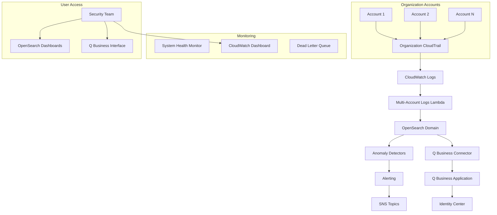

# Enhanced Multi-Account AWS Usage Anomaly Detection System

A comprehensive solution for detecting usage anomalies across multiple AWS accounts with natural language insights powered by Amazon Q for Business.

## 🌟 Features

### Multi-Account Support
- **Organization-wide CloudTrail**: Centralized logging from all AWS accounts
- **Cross-account anomaly detection**: Unified visibility across your entire organization
- **Account-aware insights**: Context-rich alerts with account metadata

### Enhanced Anomaly Detection
- **High-cardinality detection**: Account ID and region-based categorization
- **Multiple service support**: EC2, Lambda, and EBS anomaly detection
- **Intelligent thresholds**: Account type-aware threshold configuration

### Natural Language Insights
- **Amazon Q for Business integration**: Query anomalies using natural language
- **Cost impact analysis**: Automatic cost implications for detected anomalies
- **Security recommendations**: Contextual security guidance for each anomaly type

### Comprehensive Monitoring
- **Real-time dashboards**: CloudWatch dashboards with system health metrics
- **Proactive alerting**: SNS-based notifications with detailed context
- **System health monitoring**: Automated health checks and custom metrics

## 🏗️ Architecture



## 🚀 Quick Start

### Prerequisites

1. **AWS Account Setup**:
   - AWS Organizations enabled
   - Management account access
   - CDK v2.110.0+ installed

2. **Local Environment**:
   ```bash
   # Install required tools
   npm install -g aws-cdk
   pip install -r requirements.txt
   ```

3. **AWS Credentials**:
   ```bash
   aws configure
   # Ensure you have admin permissions in the management account
   ```

### Deployment

1. **Clone and Setup**:
   ```bash
   git clone <repository-url>
   cd aws-usage-anomaly-detection
   ```

2. **Deploy Multi-Account System**:
   ```bash
   ./deploy_multi_account_enhanced.sh
   ```

3. **Validate Deployment**:
   ```bash
   python3 validate_enhanced_deployment.py
   ```

## 📋 Deployment Options

### Single Account Mode
```bash
cdk deploy UsageAnomalyDetectorStack
```

### Multi-Account Mode
```bash
cdk deploy --context deployment-mode=multi-account --all
```

### Manual Stack Deployment
```bash
# 1. Organization Trail (Management Account)
cdk deploy OrganizationTrailStack

# 2. Base OpenSearch Stack
cdk deploy EnhancedUsageAnomalyDetectorStack

# 3. Multi-Account Enhancements
cdk deploy MultiAccountAnomalyStack

# 4. Q Business Integration (Optional)
cdk deploy QBusinessInsightsStack
```

## 🔧 Configuration

### Environment Variables

| Variable | Description | Default |
|----------|-------------|---------|
| `DEPLOYMENT_MODE` | Deployment mode (single-account/multi-account) | single-account |
| `AWS_DEFAULT_REGION` | AWS region for deployment | us-east-1 |
| `ENABLE_Q_BUSINESS` | Enable Q Business integration | true |
| `ENABLE_COST_ANALYSIS` | Enable cost impact analysis | true |

### Account Type Configuration

Configure account types using AWS Organizations tags:

```json
{
  "AccountType": "production|staging|development",
  "Environment": "prod|staging|dev",
  "CostCenter": "engineering|security|operations"
}
```

### Anomaly Thresholds

Customize thresholds in `lambdas/CrossAccountAnomalyProcessor/config.py`:

```python
THRESHOLDS = {
    'production': {'ec2': 10, 'lambda': 1000, 'ebs': 20},
    'staging': {'ec2': 5, 'lambda': 500, 'ebs': 10},
    'development': {'ec2': 2, 'lambda': 100, 'ebs': 5}
}
```

## 📊 Monitoring and Alerting

### CloudWatch Dashboard

Access the monitoring dashboard:
1. Go to CloudWatch Console
2. Navigate to Dashboards
3. Open "MultiAccountAnomalyDetection"

### SNS Alerts

Subscribe to system alerts:
```bash
aws sns subscribe \
  --topic-arn <SystemAlertsTopicArn> \
  --protocol email \
  --notification-endpoint your-email@example.com
```

### Custom Metrics

The system publishes custom metrics to the `MultiAccountAnomalyDetection` namespace:

- `OverallHealthScore`: System health percentage (0-100)
- `ProcessingSuccessRate`: Event processing success rate
- `LambdaErrorRate`: Lambda function error rates
- `OpenSearchUnassignedShards`: OpenSearch cluster health

## 🤖 Amazon Q for Business Integration

### Setup

1. **Identity Center Configuration**:
   - Automatic setup during deployment
   - Creates "QBusinessAdmins" group
   - Configures application assignments

2. **User Access**:
   ```bash
   # Add users to Q Business admin group
   aws identitystore create-group-membership \
     --identity-store-id <IdentityStoreId> \
     --group-id <QBusinessAdminGroupId> \
     --member-id <UserId>
   ```

### Natural Language Queries

Example queries you can ask Q Business:

- "Show me EC2 anomalies from the last 24 hours"
- "What accounts had the highest cost impact this week?"
- "Are there any security concerns with recent Lambda anomalies?"
- "Compare anomaly patterns between production and staging accounts"

## 🔍 Troubleshooting

### Common Issues

1. **CDK Version Compatibility**:
   ```bash
   # Upgrade CDK
   npm install -g aws-cdk@latest
   pip install -r requirements.txt --upgrade
   ```

2. **Organization Permissions**:
   ```bash
   # Verify organization access
   aws organizations list-accounts
   ```

3. **OpenSearch Access**:
   ```bash
   # Check domain status
   aws opensearch describe-domain --domain-name <domain-name>
   ```

### Validation Script

Run comprehensive validation:
```bash
python3 validate_enhanced_deployment.py
```

### Log Analysis

Check Lambda function logs:
```bash
# Multi-account logs processor
aws logs tail /aws/lambda/MultiAccountAnomalyStack-MultiAccountLogsFunction --follow

# Q Business connector
aws logs tail /aws/lambda/MultiAccountAnomalyStack-QBusinessConnectorFunction --follow

# System health monitor
aws logs tail /aws/lambda/MultiAccountAnomalyStack-SystemHealthMonitorFunction --follow
```

## 🔒 Security Considerations

### IAM Permissions

The system follows the principle of least privilege:

- **Lambda Functions**: Minimal permissions for their specific tasks
- **Cross-Account Access**: Secure trust relationships
- **OpenSearch**: Fine-grained access control
- **Q Business**: Identity Center-based authentication

### Data Encryption

- **In Transit**: All API calls use TLS
- **At Rest**: OpenSearch and S3 encryption enabled
- **CloudTrail**: KMS encryption for log files

### Network Security

- **VPC Deployment**: Optional VPC deployment for OpenSearch
- **Security Groups**: Restrictive security group rules
- **Private Endpoints**: VPC endpoints for AWS services

## 📈 Performance and Scaling

### Capacity Planning

| Component | Default | Scaling |
|-----------|---------|---------|
| Lambda Concurrency | 1000 | Auto-scaling |
| OpenSearch Instances | t3.small.search | Manual scaling |
| CloudWatch Logs | Unlimited | Pay-per-use |

### Cost Optimization

- **Reserved Instances**: Consider reserved OpenSearch instances
- **Log Retention**: Configure appropriate log retention periods
- **Lambda Memory**: Optimize Lambda memory allocation

## 🤝 Contributing

1. Fork the repository
2. Create a feature branch
3. Make your changes
4. Add tests
5. Submit a pull request

### Development Setup

```bash
# Install development dependencies
pip install -r requirements-dev.txt

# Run tests
python -m pytest tests/

# Run linting
flake8 lambdas/
```

## 📄 License

This project is licensed under the MIT License - see the [LICENSE](LICENSE) file for details.

## 🆘 Support

- **Documentation**: Check this README and inline code comments
- **Issues**: Create GitHub issues for bugs and feature requests
- **Validation**: Use the validation script for deployment issues

## 🔄 Updates and Maintenance

### Regular Maintenance

1. **Update Dependencies**:
   ```bash
   pip install -r requirements.txt --upgrade
   npm update
   ```

2. **Monitor System Health**:
   - Check CloudWatch dashboards daily
   - Review SNS alerts
   - Run validation script weekly

3. **Review Anomaly Patterns**:
   - Analyze false positives
   - Adjust thresholds as needed
   - Update account classifications

### Version Updates

The system supports rolling updates:
```bash
# Update with zero downtime
cdk deploy --all --require-approval never
```

---

## 📊 System Metrics

After deployment, monitor these key metrics:

- **Processing Success Rate**: >95%
- **Lambda Error Rate**: <1%
- **OpenSearch Health**: Green
- **Alert Response Time**: <5 minutes

For detailed metrics, check the CloudWatch dashboard or run the validation script.