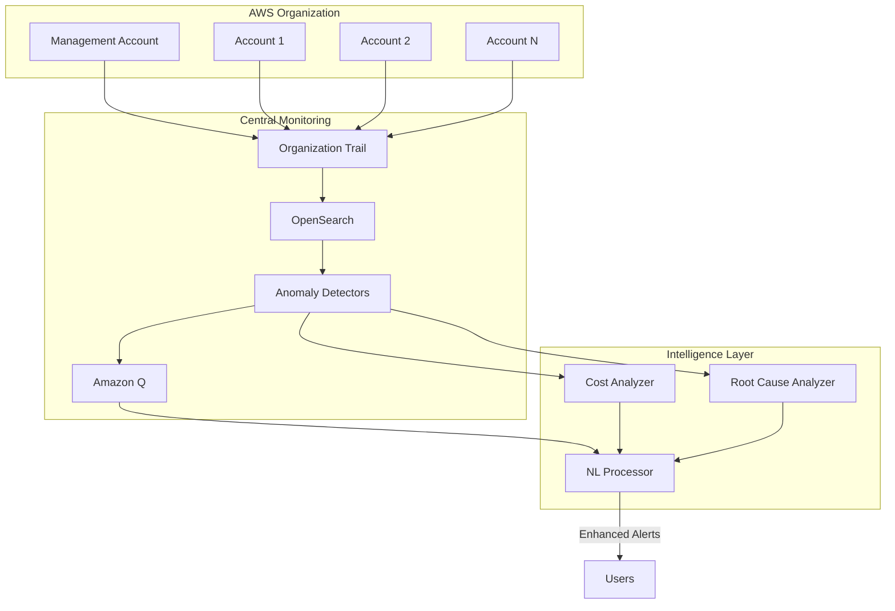

# Enhanced AWS Usage Anomaly Detection with Multi-Account Support & Natural Language Insights

## 🚀 Game-Changing Enhancements

This enhanced version of the AWS Usage Anomaly Detection solution introduces two revolutionary features:

### 1. 🏢 Multi-Account & Organization-Wide Intelligence
- **Centralized Monitoring**: Monitor anomalies across your entire AWS Organization from a single pane of glass
- **Account-Aware Detection**: Understand anomalies in the context of specific accounts, organizational units, and account types
- **Cross-Account Correlation**: Identify patterns and anomalies that span multiple accounts
- **Organization Hierarchy Insights**: Leverage your AWS Organization structure for better anomaly context

### 2. 🤖 Natural Language Insights with Amazon Q for Business
- **AI-Powered Explanations**: Get plain-English explanations of what anomalies mean
- **Intelligent Root Cause Analysis**: Automatically identify likely causes of anomalies
- **Cost Impact Analysis**: Understand the financial implications of detected anomalies
- **Actionable Recommendations**: Receive specific steps to investigate and resolve issues
- **Conversational Interface**: Ask questions about your anomalies in natural language

## 📋 Prerequisites

In addition to the base requirements:
- AWS Organization with management account access (for multi-account features)
- Amazon Q for Business access (preview or GA)
- IAM permissions for AWS Organizations API
- Additional Lambda layers for enhanced processing

## 🛠️ Installation

### 1. Install Additional Dependencies

```bash
# Install requirements for enhanced Lambda functions
pip install -r lambdas/CrossAccountAnomalyProcessor/requirements.txt -t lambdas/CrossAccountAnomalyProcessor/
pip install -r lambdas/QBusinessConnector/requirements.txt -t lambdas/QBusinessConnector/
```

### 2. Deploy in Multi-Account Mode

From the AWS Organization management account:

```bash
cdk deploy \
  --context deployment-mode='multi-account' \
  --context opensearch-version='OPENSEARCH_2_9' \
  --parameters opensearchalertemail='security-team@company.com' \
  --all
```

This will deploy:
- Organization-wide CloudTrail
- Enhanced OpenSearch with multi-account anomaly detectors
- Amazon Q for Business application
- Natural language processing pipelines

### 3. Configure Organization Accounts

For each member account, create a cross-account role:

```bash
aws iam create-role \
  --role-name AnomalyDetectorReadRole \
  --assume-role-policy-document file://cross-account-trust-policy.json
```

## 🎯 Key Features

### Multi-Account Anomaly Detection

The enhanced solution provides:

1. **Account Context Enrichment**
   - Automatic tagging of events with account aliases and types
   - Organization unit mapping for hierarchical analysis
   - Cost center attribution based on account tags

2. **Cross-Account Dashboards**
   - Organization-wide anomaly heatmap
   - Account comparison views
   - Top anomalous accounts ranking
   - Cross-account correlation analysis

3. **Smart Anomaly Grouping**
   - Anomalies grouped by account and region
   - Pattern detection across similar account types
   - Baseline learning per account category

### Natural Language Insights

Amazon Q integration provides:

1. **Conversational Anomaly Analysis**
   ```
   Example queries:
   - "What caused the spike in EC2 instances in production accounts yesterday?"
   - "Show me the cost impact of Lambda anomalies this month"
   - "Which accounts have the most EBS volume creation anomalies?"
   ```

2. **Automated Insight Generation**
   - Plain-language summaries of complex anomalies
   - Contextual explanations based on historical patterns
   - Best practice recommendations

3. **Enhanced Notifications**
   ```
   🚨 AWS Usage Anomaly Detected - Enhanced Insights
   
   📊 ANOMALY SUMMARY:
   Unusual EC2 instance creation detected in production account 
   (prod-main). 47 instances created in 10 minutes, which is 
   15x the normal rate.
   
   🔍 POTENTIAL CAUSES:
   - Auto-scaling response to traffic spike (confidence: HIGH)
   - Deployment of new application version
   - Possible automation misconfiguration
   
   💡 RECOMMENDED ACTIONS:
   1. Check auto-scaling group activities
   2. Review recent deployments
   3. Verify instance types match approved list
   
   💰 COST IMPACT:
   - Estimated additional cost: $1,247/day
   - Monthly projection: $37,410 if pattern continues
   ```

## 📊 Architecture Overview



## 🔧 Configuration

### Environment Variables

```bash
# Multi-account configuration
ENABLE_ACCOUNT_ENRICHMENT=true
ENABLE_ORG_CONTEXT=true
ORGANIZATION_ID=o-xxxxxxxxxx

# Amazon Q configuration
Q_APPLICATION_ID=<your-q-app-id>
Q_INDEX_ID=<your-q-index-id>
ENABLE_COST_ANALYSIS=true
ENABLE_ROOT_CAUSE_ANALYSIS=true

# Sync intervals
SYNC_INTERVAL_MINUTES=15
ANOMALY_EVAL_MINUTES=80
```

### Customizing Anomaly Thresholds

Edit `lambdas/QBusinessConnector/insights.py` to adjust severity thresholds:

```python
severity_thresholds = {
    'RunInstances': {'low': 5, 'medium': 10, 'high': 20},
    'CreateVolume': {'low': 10, 'medium': 20, 'high': 50},
    'Invoke': {'low': 1000, 'medium': 5000, 'high': 10000}
}
```

## 📈 Usage Examples

### 1. Query Anomalies via Amazon Q

Access the Q Business web experience and ask:
- "What are the top 3 accounts with cost anomalies this week?"
- "Explain the Lambda invocation spike in account 123456789012"
- "How can I prevent EC2 anomalies in development accounts?"

### 2. Cross-Account Analysis

Use OpenSearch dashboards to:
- Compare anomaly patterns across production vs. development accounts
- Identify accounts with similar anomaly profiles
- Track organization-wide anomaly trends

### 3. Automated Response

Configure automated responses based on anomaly severity:
```python
if anomaly['severity'] == 'HIGH' and anomaly['event_type'] == 'EC2_RunInstances':
    # Automatically apply instance quota
    apply_service_quota_limit(account_id, 'ec2-instances', current_count + 10)
```

## 🛡️ Security Considerations

1. **Cross-Account Access**: Uses least-privilege IAM roles
2. **Data Encryption**: All data encrypted in transit and at rest
3. **Q Business Access**: Controlled via IAM and Q Business policies
4. **Audit Trail**: All actions logged in CloudTrail

## 🔍 Troubleshooting

### Common Issues

1. **Q Business sync failures**: Check Lambda logs and Q index configuration
2. **Missing account context**: Verify Organizations API permissions
3. **Cost data unavailable**: Ensure Cost Explorer is enabled

### Debug Commands

```bash
# Check Q Business sync status
aws logs tail /aws/lambda/QBusinessConnectorFunction --follow

# Verify organization trail
aws cloudtrail describe-trails --trail-name-list org-trail-*

# Test account enrichment
aws lambda invoke --function-name MultiAccountLogsFunction test-output.json
```

## 🚀 Future Enhancements

- Integration with AWS Security Hub for security-focused anomalies
- Machine learning models for predictive anomaly prevention
- Slack/Teams integration for conversational anomaly management
- Custom Q Business plugins for organization-specific insights

## 📝 License

This enhanced solution maintains the MIT-0 License. See the [LICENSE](LICENSE) file.
