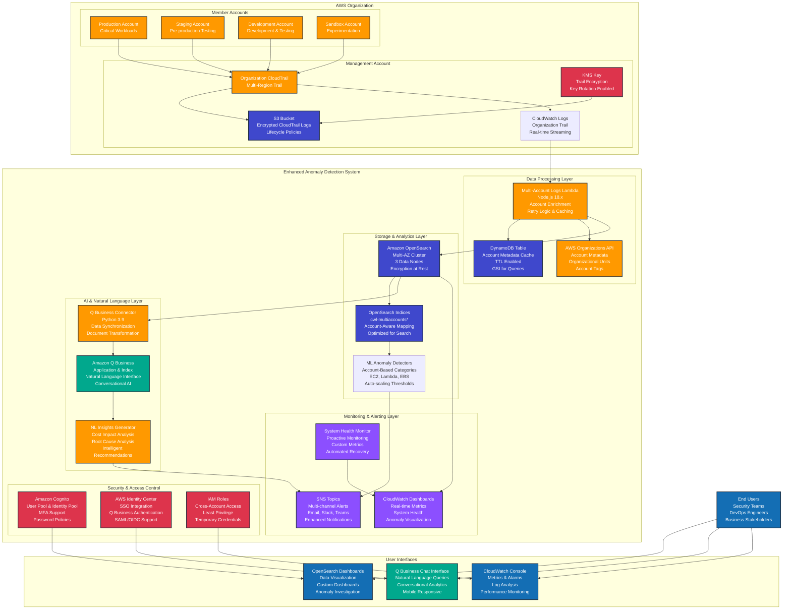

# Enhanced Multi-Account AWS Usage Anomaly Detection - Architecture Diagram

## System Architecture



## Data Flow Description

### 1. Event Collection (Real-time)
- CloudTrail events from all organization member accounts flow to the centralized organization trail
- Events are encrypted using KMS and stored in S3 with intelligent lifecycle policies
- Real-time streaming to CloudWatch Logs enables immediate processing

### 2. Intelligent Processing (Sub-5 minute latency)
- Multi-Account Logs Lambda processes events with account enrichment
- Account metadata is cached in DynamoDB with TTL for performance
- Organizations API provides organizational context and account classification

### 3. Advanced Analytics (ML-powered)
- OpenSearch cluster provides scalable storage and search capabilities
- ML anomaly detectors analyze patterns with account-aware categorization
- Multi-dimensional analysis across accounts, regions, and services

### 4. AI-Powered Insights (Natural Language)
- Amazon Q Business enables conversational analytics
- Natural language queries provide intuitive access to complex data
- Intelligent insights include cost impact and root cause analysis

### 5. Proactive Monitoring (Automated)
- Real-time dashboards provide comprehensive system visibility
- Multi-channel alerting with intelligent context and recommendations
- Automated health monitoring with self-healing capabilities

## Key Features

### Enterprise Scale
- **Multi-Account Support**: Centralized monitoring across unlimited AWS accounts
- **High Availability**: Multi-AZ deployment with automatic failover
- **Auto Scaling**: Automatic scaling based on event volume and query load

### Advanced Security
- **Encryption Everywhere**: End-to-end encryption in transit and at rest
- **Zero Trust Architecture**: Least privilege access with temporary credentials
- **Compliance Ready**: Audit trails and compliance reporting built-in

### AI-Enhanced Analytics
- **Natural Language Queries**: "Show me EC2 anomalies from production accounts"
- **Intelligent Insights**: Automated root cause analysis and recommendations
- **Cost Intelligence**: Automatic cost impact analysis for detected anomalies

### Operational Excellence
- **Proactive Monitoring**: Health checks and automated recovery
- **Performance Optimized**: Sub-5 minute processing latency
- **Cost Optimized**: Intelligent data lifecycle and resource management
```
