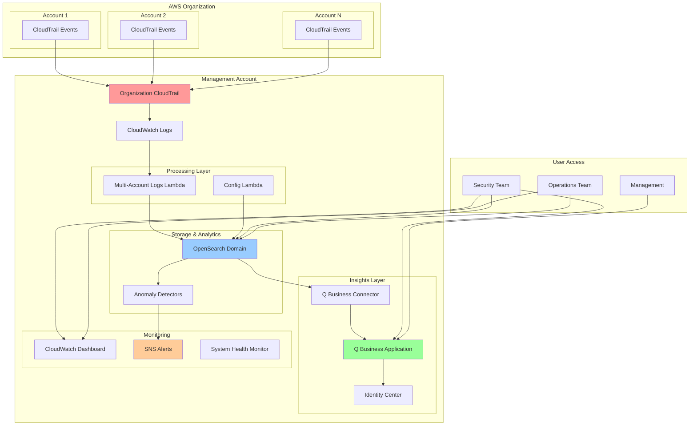
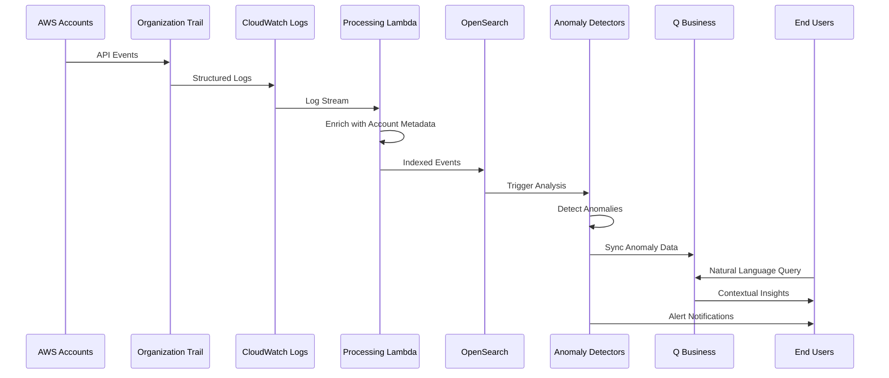
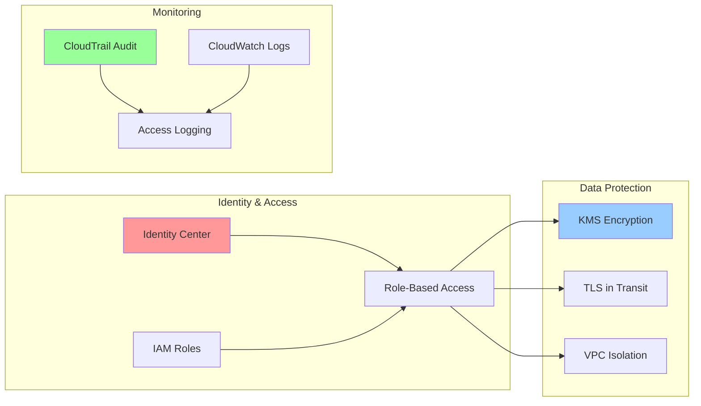
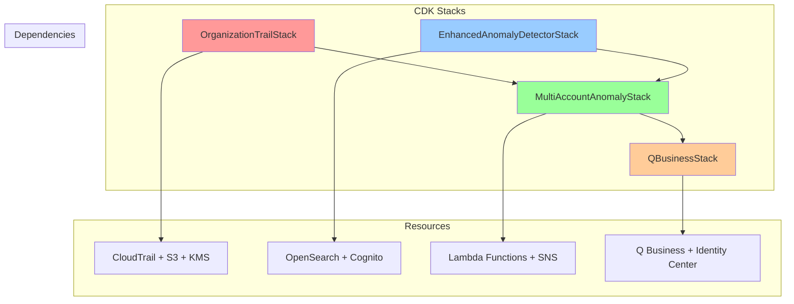

# Architecture Overview

## Multi-Account AWS Usage Anomaly Detection System

### High-Level Architecture

### Component Details

#### Data Collection Layer
- **Organization CloudTrail**: Captures management and data events from all accounts
- **CloudWatch Logs**: Centralized log aggregation point
- **Multi-Account Logs Lambda**: Processes and enriches events with account metadata

#### Analytics Layer
- **OpenSearch Domain**: Stores and indexes log data for analysis
- **Anomaly Detectors**: High-cardinality detectors categorized by account and region
- **Config Lambda**: Automatically configures detectors for new accounts

#### Insights Layer
- **Q Business Application**: Natural language interface for querying anomalies
- **Q Business Connector**: Synchronizes anomaly data for natural language processing
- **Identity Center**: Provides secure authentication and authorization

#### Monitoring Layer
- **CloudWatch Dashboard**: Real-time system health and performance metrics
- **SNS Topics**: Multi-channel alerting for anomalies and system health
- **System Health Monitor**: Automated health checks and custom metrics

### Data Flow

### Security Architecture

### Deployment Architecture

