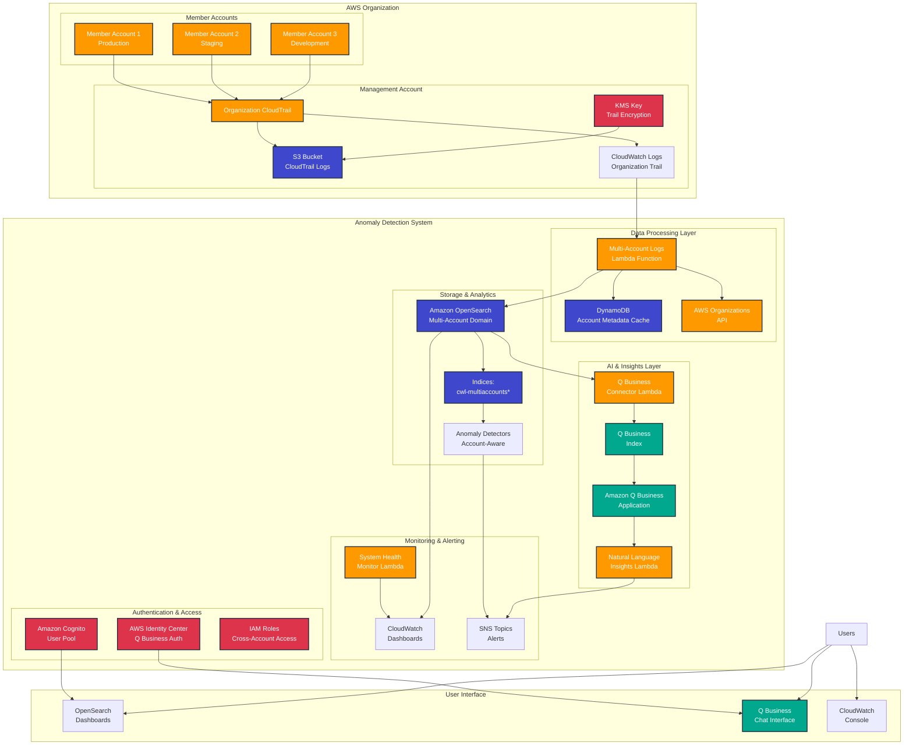

# Enhanced Multi-Account AWS Usage Anomaly Detection - Architecture

## Overview

This solution provides enterprise-grade multi-account anomaly detection with AI-powered natural language insights through Amazon Q Business integration.

## Architecture Diagram

## Component Details

### 1. Data Collection Layer
- **Organization CloudTrail**: Centralized logging across all AWS accounts
- **S3 Bucket**: Encrypted storage for CloudTrail logs with lifecycle policies
- **CloudWatch Logs**: Real-time log streaming for immediate processing

### 2. Data Processing Layer
- **Multi-Account Logs Lambda**: Processes CloudTrail events with account enrichment
- **Account Metadata Cache**: DynamoDB table for caching account information
- **AWS Organizations API**: Source of account metadata and organizational structure

### 3. Storage & Analytics Layer
- **Amazon OpenSearch**: Scalable search and analytics engine
- **Multi-Account Indices**: Organized storage with account-aware indexing
- **Anomaly Detectors**: ML-powered detection with account-based categorization

### 4. AI & Insights Layer
- **Amazon Q Business**: Natural language query interface
- **Q Business Index**: Searchable knowledge base of anomaly data
- **Connector Lambda**: Syncs anomaly data to Q Business
- **Insights Lambda**: Generates intelligent explanations and recommendations

### 5. Monitoring & Alerting
- **CloudWatch Dashboards**: Real-time system health and anomaly visualization
- **SNS Topics**: Multi-channel alerting (email, Slack, etc.)
- **Health Monitor**: Proactive system health checking

### 6. Security & Access Control
- **Amazon Cognito**: Authentication for OpenSearch dashboards
- **AWS Identity Center**: SSO integration for Q Business
- **IAM Roles**: Fine-grained cross-account permissions

## Data Flow

1. **Event Collection**: CloudTrail events from all organization accounts flow to the centralized trail
2. **Real-time Processing**: CloudWatch Logs triggers the processing Lambda for immediate analysis
3. **Account Enrichment**: Events are enriched with account metadata from Organizations API
4. **Indexing**: Enriched events are indexed in OpenSearch with account-aware categorization
5. **Anomaly Detection**: ML detectors analyze patterns across accounts and services
6. **AI Insights**: Anomalies are synced to Q Business for natural language querying
7. **Alerting**: Notifications are sent through SNS with intelligent context

## Deployment Modes

### Single Account Mode
- Deploys basic anomaly detection for a single AWS account
- Uses standard CloudTrail and OpenSearch configuration
- Suitable for smaller organizations or proof-of-concept deployments

### Multi-Account Mode
- Deploys organization-wide CloudTrail and cross-account processing
- Includes account enrichment and organizational context
- Provides centralized visibility across all organization accounts

### Multi-Account with Q Business
- Full enterprise deployment with AI-powered insights
- Natural language querying and intelligent recommendations
- Cost impact analysis and root cause suggestions

## Security Considerations

- **Encryption**: All data encrypted in transit and at rest using KMS
- **Least Privilege**: IAM roles follow principle of least privilege
- **Network Isolation**: Optional VPC deployment for enhanced security
- **Audit Logging**: Comprehensive audit trail for all system operations
- **Identity Integration**: SSO integration with existing identity providers

## Scalability Features

- **Auto Scaling**: Lambda functions scale automatically with event volume
- **OpenSearch Scaling**: Cluster scales based on data volume and query load
- **Caching**: Multi-level caching reduces API calls and improves performance
- **Batch Processing**: Efficient bulk operations for high-volume scenarios

## Cost Optimization

- **Lifecycle Policies**: Automatic data archival and deletion
- **Reserved Capacity**: OpenSearch reserved instances for predictable workloads
- **Efficient Indexing**: Optimized index patterns and retention policies
- **Smart Caching**: Reduces Organizations API calls through intelligent caching